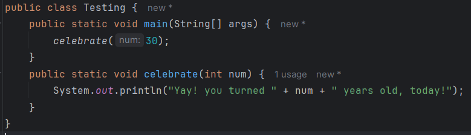
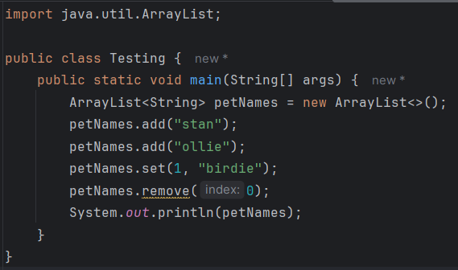

# All Review Questions for Final
## Jeopardy Game (Theory Questions)
### Logic & Loops
* What does `((6 > 7) || (-34 < 10)) && (45 < 90)` evaluate to?
  * true
* What are the two ways we can check for equality in an if statement and what are each used for?
  * ==: used for primitive data types
    .equals(): used for objects (like String)
* Name the four major loop variations in Java.
  * while loop, do-while loop, for loop, for-each loop
* What are some uses for nested loops?
  * Nested loops are ideal for working with multi-dimensional data. They are also useful for multi-dimensional arrays.
* Briefly describe the three parts of a standard for loop.
  * The variable initialization, the loop conditional, and the iteration step (update)
### Methods
* Where can I access variables that are defined in a method?
  * Variables defined within a method can only be accessed from within the scope of the method.
* List the components required to write a method header.
  * access modifier, return type, method name, parameters (data type and name)
* What does it mean to overload a method?
  * Overloading describes the concept that we can have multiple methods with the same name, provided that they take in parameters of different data types
* What does it mean to override a method?
  * Overriding occurs when we rewrite a method from a parent class in the child class. Both of these methods have the *exact* same method header
* What are the important implications of passing an object into a method (or returning the object)?
  * When an object reference is passed into or returned from a method, pass by reference occurs. This means that the reference is not copied but passed directly. If the object is passed into the method, the method can modify the object directly. If the object is returned, the caller of the method can modify the object directly.
### Arrays & File I/O
* What is the last index for an array that has a size of 10?
  * 9
* Why does the memory address get printed out when we try to print an array?
  * This happens because arrays are objects.
* If I create a two-dimensional array of integers, what am I actually storing in that array?
  * A two-dimensional array is an array of references. Each reference points to an array of integers.
* What is the difference between an absolute and relative file path?
  * The absolute path is the entire path from the root directory. It is more specific but less portable. The relative path is specified from the default working directory and therefore, is more portable.
* Describe how Java File I/O utilizes a buffer and file handle.
  * The OS creates an area in memory (a buffer) that the program can access. Assuming the program has the proper permissions, the contents of the file are copied to the buffer. Then the OS provides the program with a reference to the buffer (a file handle), so the program can indirectly access/modify the file contents.
### Keywords
* What is the void keyword?
  * Indicates that a method does not return anything.
* What is the public keyword?
  * Indicates that the method or variable can be accessed from anywhere (including outside the current class)
* What is the extends keyword?
  * Indicates an inheritance relationship between two classes
* What is the final keyword?
  * Indicates that a variable has a constant, never-changing value
* What is the static keyword?
  * Indicates that the method or variable does not require an object to be created for it to be accessed
### OOP Concepts
* What is the difference between the `this` keyword and the `super` keyword?
  * `this` is used to refer to fields and methods of the current class. `super` is used to refer to fields and methods of the parent class.
* What is encapsulation?
  * The concept of protecting our class data from unchecked modification. This involves marking our variables as private and creating getters and setters for controlled access.
* What is a constructor and when is it called?
  * The constructor is a special method with the same name as the class and no return type that is used to initialize data for the class. It is called when an object is created.
* What is the difference between a class and an object?
  * An object is an instance (or version) of the class. There can be many objects of the same class.
* What is polymorphism?
  * Polymorphism is the idea that a child class can be referred to by the type of any of its parent classes. For example, if a method took in the type 'Object', any object could be passed into that method because they all inherit from the Object class.

## mentimeter (Reading Code Questions)
### if statements (logic)
<ins>Question One</ins>


* **false**
<br></br>

<ins>Question Two</ins>


* **true**
<br></br>

<ins>Question Three</ins>


* **inyes**
<br></br>

<ins>Question Four</ins>


* **try again**
<br></br>

### Loops
<ins>Question Five</ins>


* **012**
<br></br>

<ins>Question Six</ins>


* **43210**
<br></br>

<ins>Question Seven</ins>


* **infinite loop**
<br></br>

<ins>Question Eight</ins>


* **hoorah**
<br></br>

<ins>Question Nine</ins>


* **loop00loop11loop22**
<br></br>

<ins>Question Ten</ins>


* **nothing gets printed out**
<br></br>

<ins>Question Eleven</ins>


* **1.02.07.04.0**
<br></br>

### Methods
<ins>Question Twelve</ins>


* **-5**
<br></br>

<ins>Question Thirteen</ins>



* **Yay! you turned 30 years old, today!**
<br></br>

<ins>Question Fourteen</ins>


* **27.08.0**
<br></br>

### File I/O
<ins>Question Fifteen</ins>


* **watsup**
<br></br>

### Arrays & ArrayLists
<ins>Question Sixteen</ins>


* **[I@7b23ec81**
<br></br>

<ins>Question Seventeen</ins>


* **[1, 0, 6, 4, 0]**
<br></br>

<ins>Question Eighteen</ins>


* **truefalsetrue**
<br></br>

<ins>Question Nineteen</ins>


* **error**
<br></br>

<ins>Question Twenty</ins>



* **[birdie]**
<br></br>

### Classes & Objects
<ins>Question Twenty-one</ins>


* **0**
<br></br>

<ins>Question Twenty-two</ins>


* **4**
<br></br>

<ins>Question Twenty-three</ins>


* **error**
<br></br>

<ins>Question Twenty-four</ins>


* **Pet@6acbcfc0**
<br></br>

<ins>Question Twenty-five</ins>


* **Bandit: age 4**
<br></br>

## Writing Code Questions
### if statements (logic)

**QUESTION:**

Write the if statements and logic for the following:
A vault security system has several layers of security. In order to gain entry, a person must type in the correct `pin` (7), their fingerprint must match one in the system (`isValidFingerprint`), and their `name` must also be in the system (all valid names are stored in an ArrayList<String> called `names`). In this case, `access` will be granted. However, if the person does a retinal scan (`isValidRetina`) in addition to the previous checks, then they will be granted `specialAccess` as well.

Input variables (can assume they will get values):
```java
int pin;
boolean isValidFingerprint;
String name;
boolean isValidRetina;
ArrayList<String> names = new ArrayList<>();
```

Output variables (you should assign):

```java
boolean access;
boolean specialAccess;
```

**SOLUTION:**

```java
// given
int pin;
boolean isValidFingerprint;
String name;
boolean isValidRetina;
ArrayList<String> names = new ArrayList<>();

// need initialization
boolean access = false;
boolean specialAccess = false;

// solution
if ((pin == 7) && isValidFingerprint && (names.contains(name)))
{
    access = true;
    if (isValidRetina)
    {
        specialAccess = true;
    }
}
```


### Loops

**QUESTION:**

Add a loop and logic to the following code, so that:
* If the user types “up”, `value` is increased by one
* If the user types “down”, `value` is decremented by one
* If the user types “exit”, the loop is exited
* If `value` is less than 0, exit
* If `value` is greater than 5, exit
* You don’t need to do any error checking
Provided code:
```java
Scanner scnr = new Scanner(System.in);
int value = 3;
String userInput = “”;
//[INSERT LOOP HERE]
    userInput = scnr.next();
```

**SOLUTION:**

```java
// given
Scanner scnr = new Scanner(System.in);
int value = 3;
String userInput = "";

// solution
while (!userInput.equals("exit") && value >= 0 && value <= 5)
{
    userInput = scnr.next();

    if (userInput.equals("up"))
    {
        value++;
    }
    else if (userInput.equals("down"))
    {
        value--;
    }
}
```


### Methods

**QUESTION:**

* Write a method that takes in a number of students
* Return the number of groups required to have an equal number of students in every group
* There must be a minimum of three groups
* Example input/output:
  * IN: 9 students / OUT: 3 groups
  * IN: 10 students / OUT: 5 groups
  * IN: 13 students / OUT: 13 groups
 
**SOLUTION:**

```java
public static int calcGroups(int numStudents)
{
    for (int i = 3; i <= numStudents; i++)
    {
        if ((numStudents % i) == 0)
        {
            return i;
        }
    }
    return 0;
}
```

**QUESTION:**

* Write a method header for a method that returns the price of an item, given its name and id number
* Make sure to use the most appropriate data types when possible

**SOLUTION:**

```java
public static double getItemPrice(String name, int idNum)
```

### Arrays

**QUESTION:**

* Add a line to the following code so the for loop sums all of the values in the array
* Add a line to calculate the average
* Add a line to store the average in the last index of the array

```java
double[] gpas = {3.4, 2.7, 3.8, 4.0, 0.0};
double sum = 0.0;
double avg = 0.0;
for(double gpa : gpas) {}
```

**SOLUTION:**

```java
// given
double[] gpas = {3.4, 2.7, 3.8, 4.0, 0.0};
double sum = 0.0;
double avg = 0.0;
for(double gpa : gpas)
{
    // solution
    sum = sum + gpa;
}
// solution
avg = sum / (gpas.length - 1);
gpas[(gpas.length - 1)] = avg;
```

### Classes & Objects

**QUESTION:**

* Create an object for a class called CellPhone
* Utilize a constructor that has the following parameters in the order described:
  1. An integer for the phone number (no area code)
  2. A boolean to indicate whether or not the phone is a smart phone
  3. A String to hold the brand of the phone
 
 **SOLUTION:**

 ```java
CellPhone c1 = new CellPhone(8675309, true, "Samsung");

// also acceptable

int phoneNum = 8675309;
boolean isSmart = true;
String brand = "Samsung";

CellPhone c2 = new CellPhone(phoneNum, isSmart, brand);
```

**QUESTION:**

* Fill in the code for both constructors to initialize the variables for the following class
* The no-arg constructor should initialize the variables to a starting value
* The 3-arg constructor should assign initialize the variables to the parameter values

```java
public class Part
{
    private int partNo;
    private double weight;
    private String material;
    
    public Part()
    {
        
    }
    
    public Part(int partNo, double partWeight, String partMaterial)
    {
        
    }
}
```

**SOLUTION:**

```java
public class Part
{
    private int partNo;
    private double weight;
    private String material;
    
    public Part()
    {
        partNo = 0;
        weight = 0.0;
        material = "";
    }

    public Part(int partNo, double partWeight, String partMaterial)
    {
        this.partNo = partNo; // this keyword required due to names being the same
        weight = partWeight; // different names do not require the this keyword
        setMaterial(partMaterial); // assumes that a set method has been defined
    }
}
```
